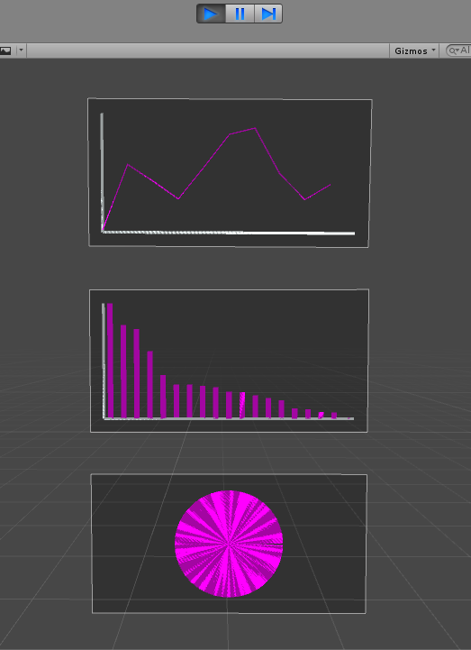

# Basic Visualization in Unity

## Get started

- add prefab into Hierarchy
- drag scripts on new GameObject

## Preview

### LICENSE

**Basic-Visualization-in-Unity** &copy; [GeekPlux](https://github.com/geekplux), Released under the [MIT](./LICENSE) License.

---

> Blog [geekplux.com](http://geekplux.com) &nbsp;&middot;&nbsp;
> GitHub [@geekplux](https://github.com/geekplux) &nbsp;&middot;&nbsp;
> Twitter [@geekplux](https://twitter.com/geekplux)